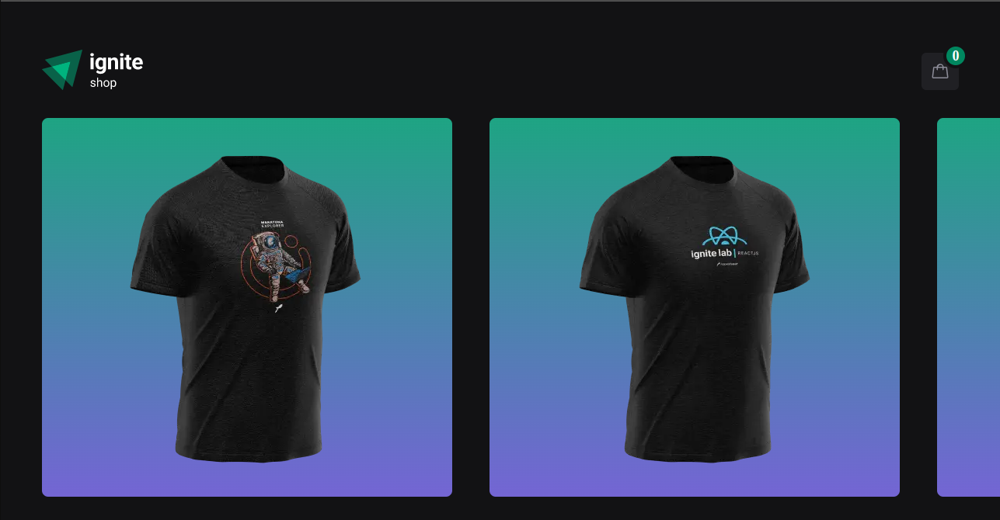
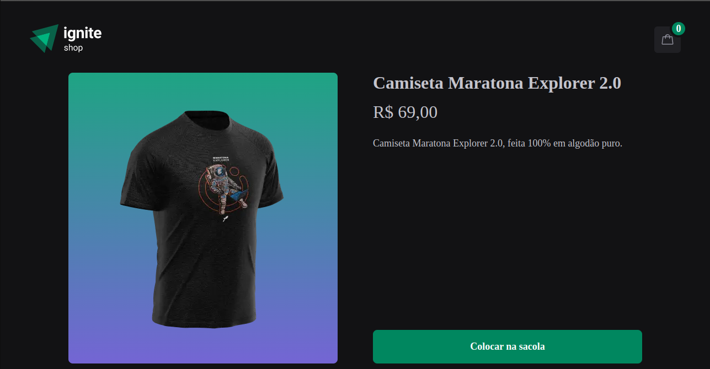
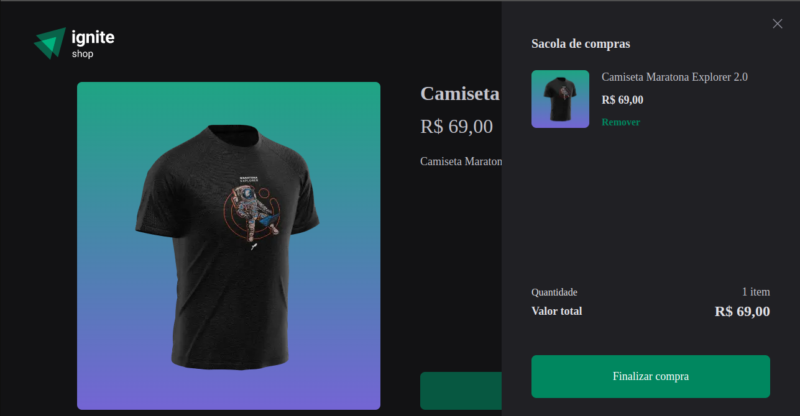
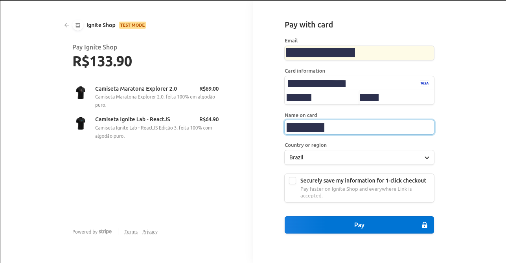
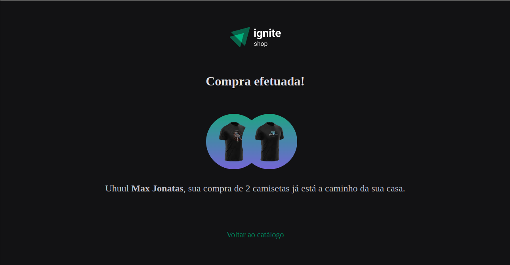

### Desafio 04/Projeto 04 - Módulo 04 - Trilha ReactJS Ignite 2022/2023
### ***Github-Blog***
#### Sobre o projeto:
 * Ignite-Shop é um desafio/projeto desenvolvido com Next.js com objetivo de criar uma loja de camisetas com a funcionalidade de compra utilizando a API Stripe.

### Principais tecnologias usadas no desenvolvimento:

* TypeScript
* Next.js
* Stitches
* Axios

### Bibliotecas em destaque:

* Stitches
* Stripe

### API usada:
#### Front-end:
* API Stripe

### Passo-a-passo para rodar a aplicação:

1. Entre na pasta Ignite-Shop;
2. use o comando: ***yarn*** ou ***npm install/i*** para instalar os pacotes;
3. use o comando:

```bash
npm run dev
# or
yarn dev
# or
pnpm dev
```

### Screenshots da aplicação:





